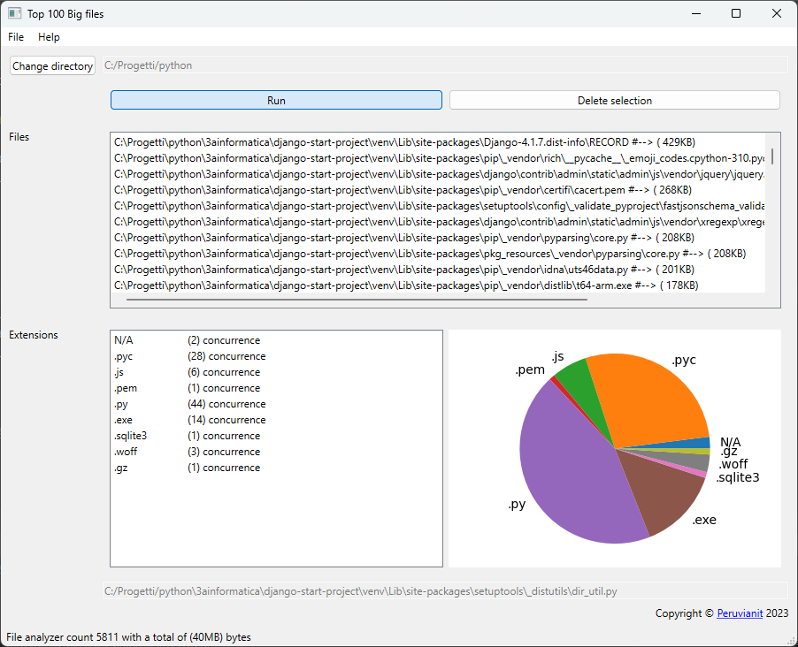

# Top Big Files

Finds the 100 largest files on your hard disk e

## Application

| name            | Version    |
|-----------------|------------|
| topBigFiles.exe | 1.0.0-Beta |

> The version of python use is the 3.10

## Screenshot

